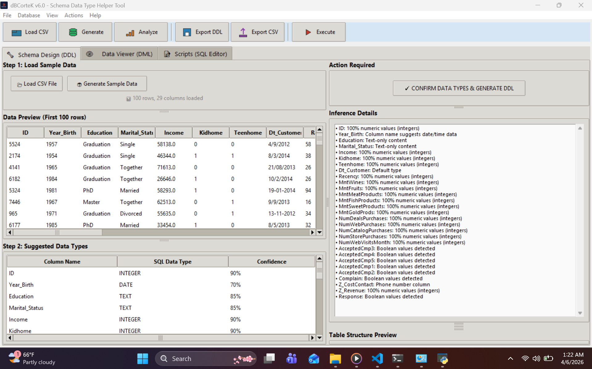
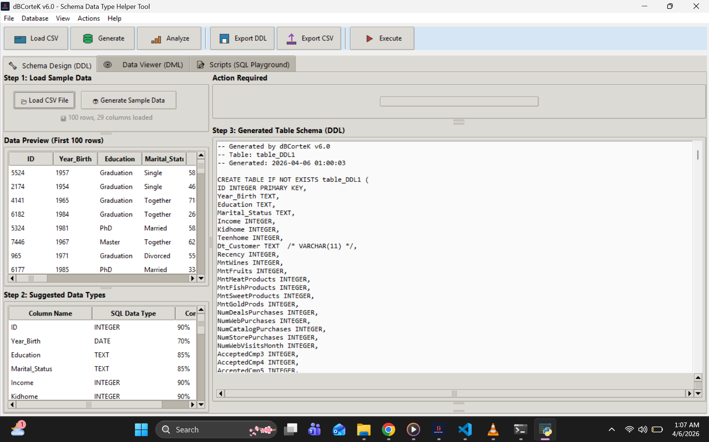
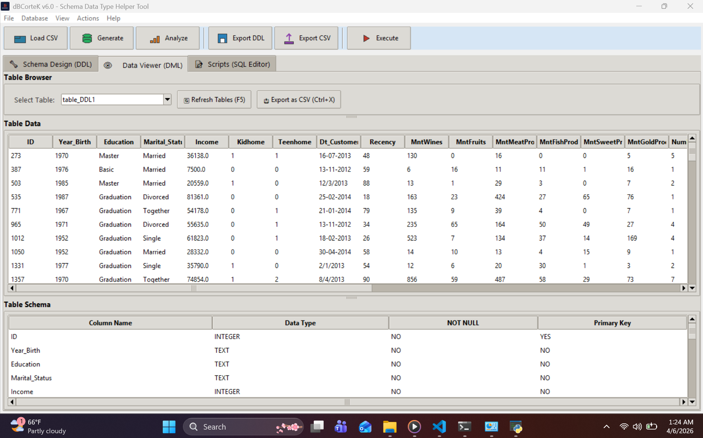
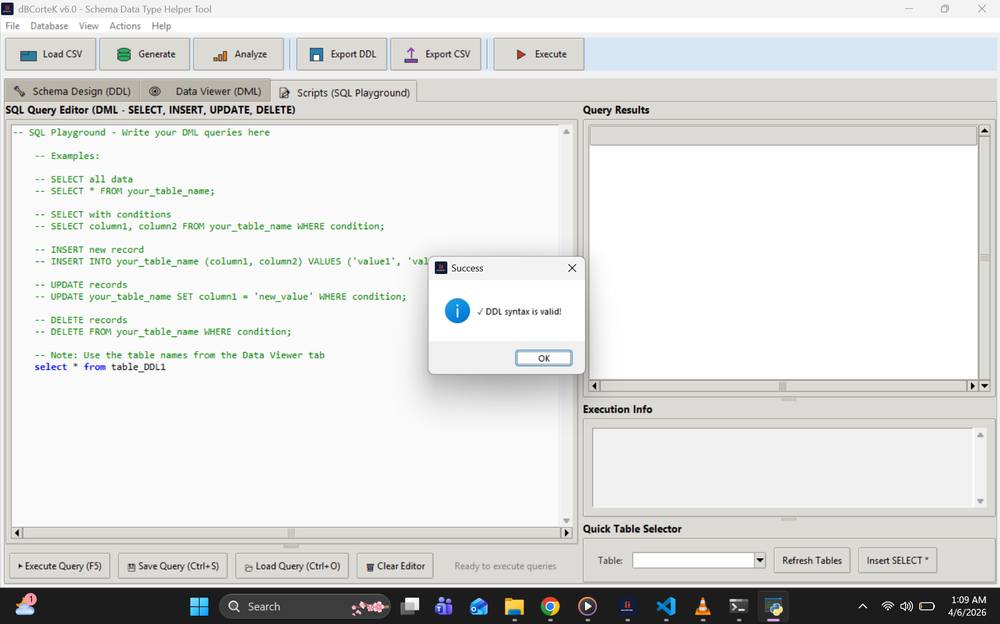
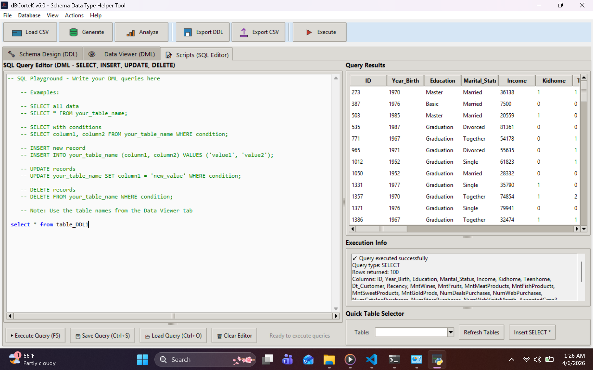

# dBCorteK - a Database Schema Data Type Helper Tool 

<div align="center">


**Intelligent Database Schema Design Helper Tool for Quality Data Storage**

[Features](#features) • [Installation](#installation) • [Quick Start](#quick-start) • [Use Cases](#use-cases) • [Technical Specifications](#technical-specifications) • [Reporting Issues](#reporting-issues)

</div>

---

## Overview

Database designers often lack Data Science perspective, leading to improper data type definitions that cause poor data quality, unreliable analytics and downstream ETL failures due to data types inconsistencies. **dBCorteK** is a free feature-rich windows desktop application that bridges this gap by using sample data that represents what will be stored in the database and statistically recommending optimal schema data types before table creation. From a Data Science perspective, the tool reduces the disproportionate time spent fixing structural flaws instead of actual analysis. I built and shared dBCorteK publicly because this silent problem wastes industry resources daily, yet existing tools focus on query performance more than quality data storage at the design stage. This tool can be useful to IT specialists with or no Data Science background and vice-versa to cushion domain knowledge gaps.

### The Problem dBCorteK Solves

**Traditional database design workflows are broken:**

- Designers guess data types without seeing actual data
- No statistical analysis of what values will be stored
- Data quality issues in analysis stages discovered only after data was already stored.
- ETL pipelines break due to unexpected data types
- Analytics produce wrong results due to improper storage

**What User can do with dBCorteK**

- Load sample data in CSV (minimum 50 records)
- Analyze each column statistically for patterns
- Suggest optimal SQL data types with confidence scores
- Generate CREATE TABLE DDL ready for execution (currently works on CREATE DDL)
- Preview table structure before creation
- Allows exporting DDL for use in production or other SQL workbenches.
- Has Custom SQL Editor to use for previewing recommended table structure using queries.

**The result:** Better data quality from day one. Reduced ETL failures. Reliable analytics. A data-science-informed schema design process.

### What is the Cortex?

The brain's cortex prepares the body for action - processing sensory information before response. Similarly, dBCorteK ensures reformated data types before actual schema is fully designed and implemented, ensuring your database is prepared for high-quality storage from the start.

---

## Features

### Core Capabilities
- **CSV Data Loading** - Load sample CSV files with minimum 50 records
- **Statistical Data Analysis** - Analyze each column for patterns, distributions, and anomalies
- **Intelligent Type Inference** - 10+ detection rules for common data patterns
- **Confidence Scoring** - Each suggestion includes confidence percentage
- **DDL Generation** - Create ready-to-execute CREATE TABLE statements
- **DDL Export** -  export DDL predefined query for further review such as adding constraints

### Current Type Inference Rules -  Commonly underestimated
- **Date/Time Detection** - Recognizes different formats including YYYY-MM-DD, MM/DD/YYYY, and datetime patterns
- **Boolean Detection** - Identifies yes/no, true/false, 1/0, Y/N and other boolean patterns
- **Phone Number Detection** - Recognizes international phone number formats
- **BLOB Detection** - Detects file extensions (.pdf, .jpg, .exe, etc.)
- **Long Text Detection** - Identifies columns with average length > 200 characters
- **Text-Only Detection** - Recognizes purely alphabetic content
- **Mixed Content Detection** - Identifies alphanumeric with special characters
- **Leading Zeros Detection** - Preserves formatting for ZIP codes, IDs
- **Numeric Detection** - Distinguishes integers from decimals

### Data Management
- **SQLite Integration** - Built-in database engine for immediate testing
- **Sample Data Generation** - Create realistic test data preserving original CSV structure
- **CSV Export** - Export any table to CSV format
- **DDL Export** - Save generated DDL as .sql files for production use
- **Data Viewer** - Browse created tables and their data

### SQL Query Editor
``` ──────────────────────────────────────────────────
• Custom Built SQL Editor to preview suggested table structures 
• Check validity of the query
• Execute queries from real database engine
```
---

## 📸 Samples (screenshoots)

### Showing the suggested data types and inference details when sample data is loaded


### Showing generated table schema details


### Sample table data type structure and data_Data Viwer(DDL) tab


### Basic SQL Query Editor Incorporated to Enhance Schema Testing
 

### Results after query execution from basic SQL Editor


### Sample Generated DDL Output - ready for further development
```sql
-- Generated by dBCorteK v6.0
-- Table: table_DDL1
-- Generated: 2026-04-06 12:09:24

CREATE TABLE IF NOT EXISTS table_DDL1 (
ID INTEGER PRIMARY KEY,
Year_Birth TEXT,
Education TEXT,
Marital_Status TEXT,
Income INTEGER,
Kidhome INTEGER,
Teenhome INTEGER,
Dt_Customer TEXT  /* VARCHAR(11) */,
Recency INTEGER,
MntWines INTEGER,
MntFruits INTEGER,
MntMeatProducts INTEGER,
MntFishProducts INTEGER,
MntSweetProducts INTEGER,
MntGoldProds INTEGER,
NumDealsPurchases INTEGER,
NumWebPurchases INTEGER,
NumCatalogPurchases INTEGER,
NumStorePurchases INTEGER,
NumWebVisitsMonth INTEGER,
AcceptedCmp3 INTEGER,
AcceptedCmp4 INTEGER,
AcceptedCmp5 INTEGER,
AcceptedCmp1 INTEGER,
AcceptedCmp2 INTEGER,
Complain INTEGER,
Z_CostContact TEXT  /* VARCHAR(10) */,
Z_Revenue INTEGER,
Response INTEGER
);
```
## Installation
Pre-compiled Installer (Recommended for End Users)
- Click dBCorteK_Setup.exe and download as a `raw` file
- Run the installer
- Follow the installation wizard
- Launch from Start Menu or Desktop shortcut

## Minimum System Requirements

| Component | Minimum | Recommended |
|-----------|---------|-------------|
| OS | Windows 10/11 (64-bit) | |
| RAM | 2GB |      |
| CPU | Dual-core |        |
| Storage | 200MB+ |        |

---

## Keyboard Shortcuts

| Shortcut | Action |
|----------|--------|
| `Ctrl+L` | Load CSV File |
| `Ctrl+G` | Generate Sample Data |
| `Ctrl+A` | Analyze Data Types |
| `Ctrl+D` | Generate DDL |
| `Ctrl+V` | Validate DDL Syntax |
| `Ctrl+R` | Execute DDL |
| `Ctrl+E` | Export DDL Script |
| `Ctrl+X` | Export Table as CSV |
| `Ctrl+N` | New Database |
| `Ctrl+O` | Open Database |
| `Ctrl+Q` | Exit Application |
| `F5` | Refresh All Views |
| `F1` | Show Help |
| `F2` | Show Keyboard Shortcuts |
| `Ctrl+Tab` | Switch to Next Tab |
| `Ctrl+Shift+Tab` | Switch to Previous Tab |
| `↑/↓` | Navigate rows in tables |
| `←/→` | Scroll horizontally |

---

## Quick Start

### Step 1: Load or Generate Data
- Click `Load CSV` or press `Ctrl+L` to import your CSV file
- OR click `Generate Sample Data` or press `Ctrl+G` to create test data
- The tool expects CSV as a representation of your future database table

### Step 2: Analyze Data (Not available in current version)
- Press `Ctrl+A` or click `Analyze Data`
- Review suggested data types and confidence scores for each column
- Methodology details appear in the right panel explaining why each type was suggested

### Step 3: Generate and Execute DDL
- Press `Ctrl+D` or click `Confirm Data Types & Generate DDL`
- Enter a table name when prompted
- Review the generated CREATE TABLE statement
- Press `Ctrl+R` to execute and create the table
- OR press `Ctrl+E` to export DDL as .sql file for production use

### Step 4: View Results
- Switch to the Data Viewer tab using `Ctrl+Tab`
- Select your table from the dropdown
- Browse table structure and sample data
---

## Confidence Level Determination

Confidence is calculated as a percentage of sample values matching the detected pattern (e.g., 85% for date detection when 85% of values match date formats), combined with additional weighting from header keyword matches and the specificity of the pattern detected.

---

## Use Cases

dBCorteK is designed for anyone who needs to design database schemas with data quality in mind.

### Data Teams
- Design new databases without guessing data types
- Ensure consistent data types across tables
- Reduce downstream ETL failures

### Database Developers Without Data Science Background
- Get data-type recommendations without statistical expertise
- Learn proper data type selection through methodology explanations
- Avoid common pitfalls like storing dates as text or losing leading zeros

### Data Quality Assurance
- Validate that proposed schemas match actual data
- Enforce proper data types from the start
- Prevent quality issues before they occur


### Why Choose dBCorteK for These Use Cases?

- **Free** - No licensing fees or subscription costs
- **Offline** - Works entirely on your Windows desktop
- **Complete Workflow** - Load, analyze, generate, execute, preview
- **Transparent** - See why each type was suggested
- **Lightweight** - Runs on CPU, no GPU needed
- **No Database Required** - Built-in SQLite for testing
- Built-in SQL Editor to test suggested schema structure

---

## Technical Specifications

### Basic Type Inference Details

| Rule | Detection Method | Output Type |
|------|-----------------|-------------|
| Date/Time | Regex patterns + header keywords | DATE, DATETIME |
| Boolean | Value patterns + header prefixes | BOOLEAN |
| Phone | Header keywords + country code detection | VARCHAR(n) |
| BLOB | File extension detection | BLOB |
| Long Text | Average length > 200 chars | TEXT |
| Text-Only | >70% alphabetic, no digits | TEXT |
| Mixed | Letters + digits in >50% of values | VARCHAR(n) |
| Leading Zeros | >70% of values start with '0' | VARCHAR(n) |
| Numeric | >80% convertible to numbers | INTEGER or REAL |

### CSV Export Specifications

| Specification | Description |
|---------------|-------------|
| Encoding | UTF-8 |
| Delimiter | Comma (,) |
| Null Handling | Stored as NULL string |
| Headers | Preserved from original data |

### DDL Export Specifications

| Specification | Description |
|---------------|-------------|
| File Extension | .sql |
| Encoding | UTF-8 |
| Comments | Include generation metadata |
| Methodology | Column inference methods documented |

---

## Reporting Issues

When reporting issues, please include:

- Operating system version
- CSV file structure (number of columns, rows)
- Steps to reproduce the issue
- Expected vs actual behavior
- Screenshots if applicable
- Error messages if any

---

## License

Distributed under the MIT License. See `LICENSE` file for more information.

---

## Contact & Support

- **Developer Email**: amosrobert857@gmail.com
- **GitHub Issues**: Use the Issues tab for bug reports and feature requests
- **Documentation**: Check the Wiki for detailed guides

---

## Frequently Asked Questions

**Q: What CSV format is supported?**
A: Standard CSV with headers in the first row. The tool reads the first 100 rows for analysis.

**Q: How many records are needed for sample data?**
A: Minimum 50 records recommended for reliable statistical analysis.

**Q: What happens if my data has missing values?**
A: Missing values are handled gracefully - they don't affect type inference.

**Q: Can I edit the DDL before execution?**
A: Yes, the DDL editor is fully editable. You can modify types, add constraints, or adjust the schema.

**Q: Does the tool modify my original CSV file?**
A: No, the CSV is only read for analysis. Your original data remains unchanged.

**Q: Can I use this with PostgreSQL or MySQL?**
A: Export the DDL as .sql and adapt the syntax for your target database. SQLite types map closely to standard SQL.

**Q: How is confidence calculated?**
A: Confidence is the percentage of sample values matching the detected pattern, weighted by header keyword matches and pattern specificity.

**Q: Why VARCHAR size recommendation?**
A: The tool calculates the 95th percentile length of your data plus 10% buffer to accommodate future growth.

**Q: Can I load multiple CSV files?**
A: Currently one CSV at a time. Future versions will support multiple tables and relationships.

---

<div align="center">

Built with ❤️ for the Database Community

[Report Bug](https://github.com/Amos77Robert/dbcortek/issues) · [Request Feature](https://github.com/Amos77Robert/dbcortek/issues)

</div>
